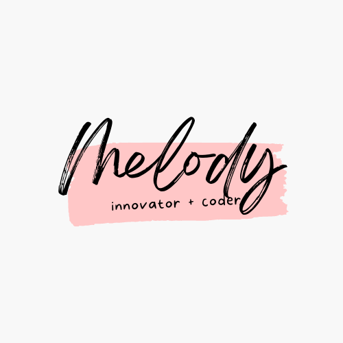

</img>

### Hi there 👋

I'm a final year student from the Singapore University of Technology and Design graduating in the Fall of 2022. I'm pretty much an aspiring software engineer looking to work with anything and everything.

Ask me anything in the contact section.

I work on projects that interest me. I even work on these projects for free if it's for a social cause.

### Skills
UI/UX design 🎨  
Product design  
Full stack Developer  
React  
Nodejs  
PHP  
MYSQL  
Python  
Docker  

### Contact
[
</img>
](https://t.me/caramel_melmel)
[
</img>
](https://www.linkedin.com/in/melody-yun-341951179/)
[</img>
](https://www.instagram.com/caramel.melmel/)

<!--
**caramelmelmel/caramelmelmel** is a ✨ _special_ ✨ repository because its `README.md` (this file) appears on your GitHub profile.

Here are some ideas to get you started:

- 🔭 I’m currently working on ...
- 🌱 I’m currently learning ...
- 👯 I’m looking to collaborate on ...
- 🤔 I’m looking for help with ...
- 💬 Ask me about ...
- 📫 How to reach me: ...
- 😄 Pronouns: ...
- ⚡ Fun fact: ...
-->
